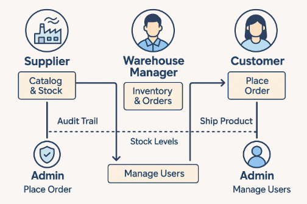

📦 Project Overview: Enterprise Supply Chain API
This backend system is built with Java and Spring Boot to manage complex logistics workflows in enterprise 
environments. It enforces role-based access control (RBAC), ensuring that each user operates within clearly defined 
permissions. The system is designed to be secure, scalable, and aligned with real-world business logic.

# 🔐 **Core Functionalities by Role**

🛠️ Admin
Register new users and assign roles
Oversee all transactions between suppliers, warehouses, and customers

🏭 Supplier
Maintain product catalog (add/update products, set prices, categories)
Manage supplier stock (Product.quantity)
Accept/reject purchase orders from warehouses
Ship products to warehouses (decreases supplier stock, increases warehouse inventory)

🏬 Warehouse Manager
Browse supplier products and create purchase orders
Accept/reject customer orders
Ship products to customers (decreases warehouse inventory)
Confirm deliveries from suppliers (increase warehouse inventory)

🛒 Customer
Browse warehouse products
Place orders to the warehouse
Cancel orders (if pending/accepted)
Receive invoices and notifications

------------------------------------------------------------------------------------------------------------------------

# **🧠 Technical Architecture Flow**

📦 CustomerOrderController → CustomerOrderService
create() → orderRepo.save(PENDING)
cancel() → orderRepo.update(CANCELLED)
confirmReceived() → orderRepo.update(RECEIVED)

🏬 WarehouseCustomerOrderController → CustomerOrderService
accept() → orderRepo.update(ACCEPTED) + invoiceService.sendInvoice()
reject() → orderRepo.update(REJECTED)
ship() → orderRepo.update(SHIPPED) + inventoryRepo.decrease()

🏭 WarehouseOrderController → PurchaseOrderService
create() → orderRepo.save(PENDING)
ship() → orderRepo.update(SHIPPED) + productRepo.decrease() + inventoryRepo.increase()
markReceived() → orderRepo.update(RECEIVED)
rejectDelivery() → orderRepo.update(REJECTED)

🗃️ Repositories
UserRepository → manage users and roles
ProductRepository → supplier stock
InventoryRepository → warehouse stock
OrderRepository → customer and purchase orders

📦 Entities
User (with primaryRole and roles)
Product (supplier stock)
InventoryItem (warehouse stock)
CustomerOrder
PurchaseOrder

🧭 System Diagram
The included diagram illustrates the flow of actions and responsibilities between roles:
-Suppliers manage catalog and stock
-Warehouse Managers handle inventory and order fulfillment
-Customers place orders
-Admins oversee transactions and user management

Each interaction is tracked with audit trails, stock updates, and delivery confirmations to ensure accountability and transparency across the supply chain.

